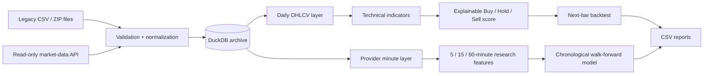

# MarketSignalLab

[](https://github.com/Robert-Pelot/MarketSignalLab/actions/workflows/ci.yml)
[](https://www.python.org/)
[](LICENSE)

MarketSignalLab is an educational Python toolkit for preserving historical market data, calculating explainable technical signals, building reproducible research datasets, and evaluating prediction ideas without look-ahead bias.

The project began as stock-analysis coursework and was later rebuilt as a tested portfolio project with a command-line interface, DuckDB storage, resumable data ingestion, technical indicators, backtesting, and chronological walk-forward evaluation.

**Portfolio:** [Life in Your 50s — Projects](https://mystorageaccountusasa.z13.web.core.windows.net/projects.html)

> **Important:** This software is for education and software demonstration only. It is not financial advice and does not place trades.

## 30-second overview

| | |
|---|---|
| **Problem** | Turn inconsistent historical market files and provider data into reproducible analysis and research workflows |
| **Stack** | Python 3.11+, pandas, DuckDB, scikit-learn-style logistic-regression research workflow |
| **Data pipeline** | Legacy CSV/ZIP migration, daily updates, resumable one-minute backfills |
| **Analysis** | Technical indicators, explainable Buy/Hold/Sell scoring, next-bar backtesting |
| **Research** | Leakage-aware, chronological walk-forward evaluation of baseline vs. technical features |
| **Quality** | Automated tests, GitHub Actions across Python 3.11/3.12/3.13, documented security boundaries |

## Architecture



The design keeps raw historical evidence, curated daily bars, provider minute data, and research features separate so one workflow does not silently change the meaning of another.

## What this demonstrates

- Python package and CLI design
- Streaming migration of thousands of legacy per-ticker files
- Data validation, deduplication, rejection logging, and reproducible storage
- DuckDB-based historical archives
- Resumable API backfills with coverage checkpoints
- Technical-indicator implementation and explainable component scoring
- Regular-session 5-, 15-, and 60-minute feature generation
- Chronological walk-forward model evaluation
- Explicit protection against same-bar execution and target leakage
- Transaction-cost-aware diagnostics
- Automated testing and multi-version CI
- Security-conscious handling of read-only provider credentials

## Verified legacy migration

The archive workflow was tested against the complete August 2024 legacy snapshot:

- **3,528** ticker files processed without file-import errors
- **26,677,199** validated source rows retained
- **3,526** symbols with usable prices
- **869,859** daily bars generated for consistent analysis
- **4,190** zero-price rows rejected and documented
- approximately **1.02 GiB** final DuckDB size

Two ticker files (`MRNJ` and `NEOM`) contained no positive prices and therefore do not appear in the curated price tables.

## Quick start

Python 3.11 or newer is required.

### Windows PowerShell

```powershell
py -m venv .venv
.\.venv\Scripts\Activate.ps1
python -m pip install -e .
python -m market_signal_lab demo
```

### Linux or macOS

```bash
python3 -m venv .venv
source .venv/bin/activate
python -m pip install -e .
python -m market_signal_lab demo
```

The demo uses deterministic synthetic daily prices, requires no network connection, and does not require an API key.

Save the full calculated dataset with:

```bash
python -m market_signal_lab demo --output reports/demo-analysis.csv
```

## Historical archive workflow

### Build from the legacy source

```powershell
python -m market_signal_lab archive-inspect "C:\path\to\Python-candidates-source.zip"

python -m market_signal_lab archive-build `
  "C:\path\to\Python-candidates-source.zip" `
  "D:\MarketData\market-history.duckdb"
```

The archive records validated prices, daily bars, per-symbol coverage, import results, and rejected-row reasons.

The legacy files mix one-minute, five-minute, and hourly observations without identifying the interval on each row. MarketSignalLab therefore preserves every source record while using daily resampling for indicator calculations rather than pretending the legacy rows form one uniform intraday series.

### Update with read-only provider data

MarketSignalLab can extend the archive using Alpaca's Historical Bars endpoint. The project does not import Alpaca's trading API and cannot submit an order.

```powershell
python -m market_signal_lab archive-update `
  "D:\MarketData\market-history.duckdb" `
  --symbols AAPL,MSFT,NVDA `
  --feed iex
```

The updater follows pagination, retries transient failures, and defaults to avoiding an unfinished current-day bar.

### Resumable one-minute backfill

```powershell
python -m market_signal_lab archive-backfill-minutes `
  "D:\MarketData\market-history.duckdb" `
  --symbols AAPL,MSFT,NVDA `
  --start 2026-08-31 `
  --end 2026-09-06 `
  --feed sip
```

Completed symbol/date chunks are recorded so an interrupted backfill can resume without starting over. The provider minute layer is intentionally separate from the mixed-frequency legacy source and the curated daily table.

## Research workflow

The research pipeline uses consistent provider minute data, keeps only the regular US equity session, and can build 5-, 15-, or 60-minute bars.

Build a five-minute research set:

```powershell
python -m market_signal_lab research-build `
  ".\data\market-history.duckdb" `
  --interval 5 `
  --feed sip `
  --start 2025-09-08 `
  --end 2026-09-07
```

Two feature sets support controlled comparisons:

| Feature set | Contents |
|---|---|
| `baseline` | Returns, range, close location, volume, volatility, 20-period trend, RSI, bar coverage, time of day |
| `technical` | Baseline features plus normalized trend, Bollinger Bands, MACD, ATR, stochastic, OBV pressure, Chaikin Money Flow, VWAP distance, trade-count activity |

Every feature is available when its bar closes. The prediction target is the **following adjacent bar's** open-to-close return, avoiding the use of a same-bar closing value as though it were known earlier.

Run a chronological evaluation:

```powershell
python -m market_signal_lab research-evaluate `
  ".\data\market-history.duckdb" `
  --interval 5 `
  --feature-set baseline `
  --train-sessions 126 `
  --test-sessions 21 `
  --holdout-sessions 21 `
  --target-move-bps 5 `
  --confidence 0.55 `
  --transaction-cost-bps 5 `
  --output ".\reports\walk-forward-5m-baseline.csv"
```

Each fold trains only on earlier sessions and evaluates a later month. Scaling and logistic-regression fitting occur inside each training fold. The newest holdout sessions remain excluded from fitting and model selection.

The output includes fold metrics, per-symbol results, and standardized coefficient reports so a strong headline number can be checked for concentration or instability.

## Explainable signal model

The original combined score remains deliberately transparent:

| Component | Positive evidence | Negative evidence |
|---|---|---|
| Bollinger percent-B | Price near/below lower band | Price near/above upper band |
| RSI | Oversold range | Overbought range |
| MACD histogram | Positive momentum / bullish crossover | Negative momentum / bearish crossover |
| Stochastic %K | Oversold range | Overbought range |
| Chaikin Money Flow | Positive money flow | Negative money flow |
| 50-period trend | Close above moving average | Close below moving average |

A score of `+3` or higher becomes **Buy**, `-3` or lower becomes **Sell**, and the remainder becomes **Hold**. These thresholds are heuristics for demonstrating the software workflow; they are not presented as a proven trading strategy.

## Backtesting decisions

The backtester reads a signal only after its bar has closed and executes at the **next bar's opening price**. It can deduct configurable transaction costs and compare results with a basic buy-and-hold benchmark.

This deliberately avoids the original prototype's unrealistic same-bar execution assumption.

The implementation does **not** model bid/ask spread, market impact, dividends, taxes, partial fills, short selling, or changing liquidity. Past simulated performance does not predict future results.

## Quality and tests

```bash
python -m compileall -q src tests
python -m unittest discover -s tests -v
```

Tests cover archive migration, ZIP/folder input, resumable minute backfills, provider pagination, session filtering, intraday aggregation, adjacent next-bar targets, chronological folds, indicators, signal repeatability, validation, next-bar execution, transaction costs, CSV round trips, and the CLI.

GitHub Actions runs the automated checks on Python 3.11, 3.12, and 3.13.

## Project layout

```text
MarketSignalLab/
├── .github/workflows/ci.yml
├── src/market_signal_lab/
│   ├── analysis.py
│   ├── archive.py
│   ├── backtest.py
│   ├── cli.py
│   ├── demo.py
│   ├── indicators.py
│   ├── intraday.py
│   ├── io.py
│   ├── research.py
│   └── signals.py
├── tests/
├── CONTRIBUTING.md
├── LICENSE
├── SECURITY.md
└── pyproject.toml
```

## Security and scope

- The repository contains no order-placement integration.
- Optional market-data credentials are loaded from the process environment.
- Generated DuckDB files and reports are intentionally excluded from Git.
- The logistic model is a transparent research baseline, not evidence of a profitable system.
- An unexpectedly strong result is treated as a reason to check for leakage, duplicated timestamps, survivorship bias, class imbalance, or other methodological problems.

See [SECURITY.md](SECURITY.md) for the credential-handling policy.

## Research roadmap

1. Compare 5-, 15-, and 60-minute horizons without choosing from test results.
2. Add an explicit validation period for feature/model selection.
3. Expand evaluation across more symbols and liquidity groups.
4. Repeat across multiple market regimes.
5. Reserve the newest period as a final untouched test.
6. Build a portfolio simulation only after independent-signal results are stable enough to justify it.

## License

Released under the [MIT License](LICENSE).
